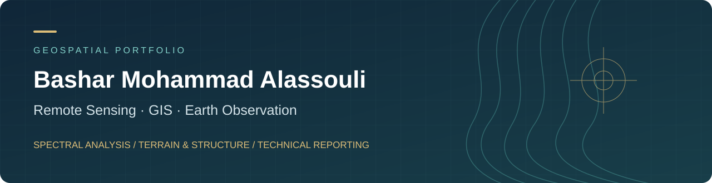

<strong>Satellite imagery → spatial evidence → exploration priorities</strong>

<a href="professional/Bashar_Mohammad_Alassouli_GIS_Remote_Sensing_CV.pdf">View CV</a> ·
<a href="#featured-projects">Featured projects</a> ·
<a href="reports/README.md">Report library</a> ·
<a href="mailto:basharalasouli1993@gmail.com">Email</a> ·
<a href="https://www.linkedin.com/in/bashar-alasouli/">LinkedIn</a>

---

## Professional profile

I am **Bashar Mohammad Alassouli**, a remote sensing and geospatial analyst with a civil engineering background, based in Jordan. My portfolio focuses on satellite image processing, spectral interpretation, terrain and structural analysis, and technical reporting for mineral exploration.

I independently carry out imagery processing, interpretation, map preparation and reporting for international client projects. My independent professional work began in **January 2022 and is ongoing**.

**Seeking opportunities in GIS, Remote Sensing, Earth Observation and Geospatial Analysis**, including remote employment, consulting and freelance projects.

## Featured projects

### 01 / Advanced Gold Exploration Targeting
**Integrated evidence · Location-anonymized · English & Arabic**

An integrated study that moves from spectral screening to a testable exploration target and a staged field-verification plan.

- **Methods:** diagnostic band ratios, PCA/Crosta, independent multi-date checks, terrain metrics, multi-azimuth hillshade and screened lineaments.
- **Deliverables:** analytical maps and plates, an integrated target model, confidence classification, field sampling recommendations and laboratory QA/QC planning.
- **Decision supported:** prioritize Target A for reconnaissance and representative sampling.
- **Evidence boundary:** field verification, gold assays and economic viability are not established within this study.

[**Read the case study →**](case-studies/01-advanced-gold-exploration/README.md) · [English report · 81 pages](https://github.com/basharalasouli1993-blip/B.M.A/releases/download/exploration-reports-v1/Exploration_Report_EN_Full_Images.pdf) · [التقرير العربي · 81 صفحة](https://github.com/basharalasouli1993-blip/B.M.A/releases/download/exploration-reports-v1/Exploration_Report_AR_Full_Images.pdf)

### 02 / Satellite Data Integration for Exploration
**Sentinel-2 · ASTER · Spectral transforms · Sudan**

A methodology-focused example of combining satellite datasets to investigate alteration indicators and compare historical and recent imagery.

- **Methods documented:** preprocessing, band ratios, PCA, MNF and terrain-derived structural context.
- **Deliverables:** spectral composites, alteration-response maps and comparative interpretations.
- **Portfolio emphasis:** preparing comparable imagery and interpreting converging evidence across datasets.

[**Read the public methodology summary →**](case-studies/02-satellite-data-integration/README.md)

### 03 / Alteration Mapping in a Vegetated Environment
**Multispectral interpretation · Vegetation interference · Ghana**

A bilingual reporting example addressing the challenge of separating surface alteration responses from vegetation effects.

- **Methods documented:** spectral ratios and composites, vegetation masking considerations, and comparison of alteration indicators.
- **Deliverables:** interpretation maps, technical explanations and recommendations for field follow-up.
- **Portfolio emphasis:** adapting interpretation to land cover and communicating uncertainty.

[**Read the public project summary →**](case-studies/03-vegetated-terrain/README.md)

### 04 / Lithological & Spectral Interpretation
**Host-rock context · Image comparison · Oman & Mauritania**

Exploration reporting examples examining spectral contrasts, host-rock context and changes between imagery dates.

- **Oman:** interpretation of ultramafic host-rock and chromite-associated surface indicators.
- **Mauritania:** preliminary spectral alteration screening and multi-date image interpretation.
- **Portfolio emphasis:** geological context, visual comparison and clear technical reporting.

[**Read the public project summary →**](case-studies/04-lithological-interpretation/README.md)

## Skills & analytical outputs

| Capability | Methods and practical outputs |
| :--- | :--- |
| Satellite image processing | Coverage review, clipping, spatial alignment, common-grid preparation and spectral enhancement |
| Spectral analysis | Band ratios, PCA/Crosta and MNF; composites and potential alteration-response maps |
| Terrain & structural analysis | DEM interpretation, hillshade, lineament extraction and screening; structural-context maps |
| Multi-date interpretation | Comparison of historical and recent imagery; review of anomaly persistence and surface change |
| Evidence integration | Compare coincident responses, define investigation priorities and explain confidence |
| Technical communication | Thematic maps, figure-led interpretation and Arabic / English reports |
| Verification planning | Proposed field sampling, laboratory analysis and QA/QC controls |

### Tools

**ArcGIS · QGIS · ENVI · PCI Geomatica · SNAP**

Listed in my CV. Portfolio imagery includes **Sentinel-2 and ASTER** studies, with terrain-derived evidence in the integrated exploration workflow.

**Additional CV-listed experience:** SAR analysis, Random Forest, and AI-assisted Python scripting and deep learning workflows. This repository currently showcases reports and interpretation products; it does not provide runnable code or independently benchmarked models for those additional workflows.

## How I approach an analysis

**Prepare comparable data → screen spectral responses → check persistence → review terrain and structure → integrate evidence → communicate a field-verification decision.**

Spectral responses indicate surface properties and possible alteration. Mineral identity, ore grade, subsurface continuity and economic viability require appropriate ground evidence. Numerical accuracy claims and client assay claims are not presented here as independently validated portfolio results.

## Report library

[**Browse the organized library →**](reports/README.md)

- **Case studies:** concise project narratives and links to the available location-anonymized reports.
- **Public report library:** 13 PDF copies (159 pages), organized by study group with direct report links.
- **Professional documents:** [CV](professional/Bashar_Mohammad_Alassouli_GIS_Remote_Sensing_CV.pdf).

Public copies retain the original page counts and technical figures, with identified coordinates, precise place identifiers and map/boundary links redacted. Original repository files remain unchanged at their existing paths; redacting these copies does not remove location data from the preserved originals.

## Relevant training

Completed **January 2026** training through NASA ARSET, Esri, EO College / HYPERedu, EO AFRICA, FutureLearn and GEO University. Topics include remote sensing fundamentals, hyperspectral imagery, SAR, Earth observation machine learning, drought monitoring, spatial reference systems and archaeological remote sensing.

[**Browse all 24 training records and certificates →**](professional/certificates/README.md) · [**Download the latest approved CV →**](professional/Bashar_Mohammad_Alassouli_GIS_Remote_Sensing_CV.pdf)

**Work availability:** onsite, hybrid or remote within Jordan; international opportunities must allow remote work from Jordan without relocation.

## Education

**Bachelor of Civil Engineering — Yarmouk University, 2020**  
Civil engineering training — Directorate of Public Works, Irbid, 2017.

## Contact

**Bashar Mohammad Alassouli · Jordan**

[**basharalasouli1993@gmail.com**](mailto:basharalasouli1993@gmail.com) · **+962 79 290 2438**  
[LinkedIn](https://www.linkedin.com/in/bashar-alasouli/) · [GitHub](https://github.com/basharalasouli1993-blip) · [CV](professional/Bashar_Mohammad_Alassouli_GIS_Remote_Sensing_CV.pdf)

For employment or project enquiries, please include the role or objective, required deliverables and expected timeline.
